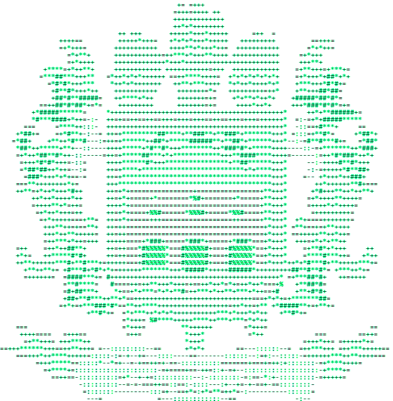

# UFRA Notes - Sistema de Gerenciamento de Notas Gamificado

<div align="center">
  
  <br><br>
  Uma aplicação web para gerenciamento de notas com elementos de gamificação, desenvolvida para a Universidade Federal Rural da Amazônia.
</div>

## 📋 Sobre o Projeto

UFRA Notes é um sistema de gerenciamento de notas que incorpora elementos de gamificação para tornar a experiência de organização de estudos mais envolvente e motivadora. O sistema permite que estudantes criem, organizem e compartilhem suas anotações, além de ganhar pontos de experiência (XP) ao completar tarefas associadas às notas.

### Principais Funcionalidades

- ✅ Criação e gerenciamento de notas
- 📝 Editor de texto com suporte a checklists
- 🎮 Sistema de gamificação com XP e níveis __(Em progresso...)__
- 🔄 Sincronização de dados em tempo real 
- 🧠 Mapa mental para visualização das conexões entre notas __(Em progresso...)__
- 📱 Interface responsiva e amigável
- 🔒 Sistema de autenticação seguro

## 🚀 Tecnologias Utilizadas

### Frontend
- React.js
- Styled Components
- React Router
- Axios

### Backend
- Django
- Django REST Framework
- MySQL
- JWT Authentication
 
## 🛠️ Instalação e Configuração

### Pré-requisitos

- Node.js (v14 ou superior)
- Python (v3.8 ou superior)
- MySQL

### Passos para Instalação

1. Clone o repositório:
   ```bash
   git clone https://github.com/inaciodinucci/UFRA-Notes.git
   cd UFRA-Notes
   ```

2. Execute o script de instalação:
   ```bash
   ./install.bat
   ```
   
   Este script instalará todas as dependências necessárias para o frontend e backend.

3. Configure o banco de dados:
   ```bash
   ./setup_database.bat
   ```
   
   Este script configurará o banco de dados MySQL para o projeto.

4. Inicie a aplicação:
   ```bash
   ./start.bat
   ```

5. Acesse a aplicação em [http://localhost:3000](http://localhost:3000)

## 🧩 Estrutura do Projeto

```
Ufra-Notes/
├── backend/           # Código do backend Django
│   ├── apps/          # Aplicações Django
│   ├── ufranotes/     # Configurações do projeto
│   └── ...
├── frontend/          # Código do frontend React
│   ├── public/        # Arquivos públicos
│   ├── src/           # Código fonte
│   │   ├── components/  # Componentes React
│   │   ├── pages/       # Páginas da aplicação
│   │   ├── services/    # Serviços e API
│   │   └── ...
├── resources/         # Recursos estáticos
├── install.bat        # Script de instalação
├── setup_database.bat # Script de configuração do banco de dados
└── start.bat          # Script para iniciar a aplicação
```

## 📸 Capturas de Tela

<div align="center">
  <p>Em breve...</p>
</div>

## 🤝 Contribuição

Contribuições são bem-vindas! Para contribuir:

1. Faça um fork do projeto
2. Crie uma branch para sua feature (`git checkout -b feature/nova-funcionalidade`)
3. Faça commit das suas alterações (`git commit -m 'Adiciona nova funcionalidade'`)
4. Faça push para a branch (`git push origin feature/nova-funcionalidade`)
5. Abra um Pull Request

## 📄 Licença

Este projeto está licenciado sob a [Licença MIT](LICENSE).

## 👥 Equipe

- [Dinucci](https://github.com/inaciodinucci) - Desenvolvedor

## 🔗 Links Úteis

- [UFRA - Universidade Federal Rural da Amazônia](https://novo.ufra.edu.br)

---

<div align="center">
  Desenvolvido com ❤️ para a UFRA.
</div> 
